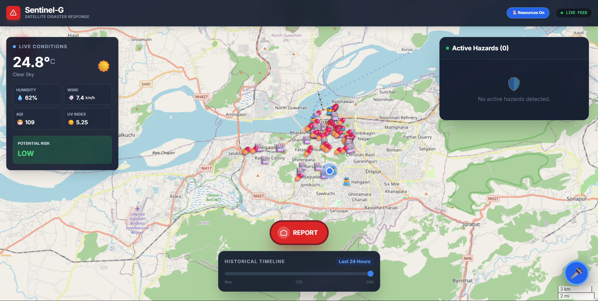

# Sentinel-G 🛰️
### AI-Powered Satellite Disaster Response System

Sentinel-G is a multimodal crisis command center designed for the Northeast India region. It fuses satellite imagery, AI-powered analysis, and ground-level reporting to establish ground truth during disasters (floods, landslides, etc.).



## 🌟 Key Features

### 🧠 Advanced AI Analysis
- **Multimodal Understanding**: Analyzes both **Images** and **Audio** to detect hazards.
- **Gemini 3 Flash**: Rapidly identifies disaster type, severity, and estimates impact radius.
- **Predictive Impact**: Visualizes the estimated spread of hazards (e.g., flood zones) on the map.

### 🛡️ Resilience & Safety
- **SOS Beacon**: A prominent panic button that instantly shares your **GPS Location** and **Battery Level** via WhatsApp/SMS.
- **Offline-First (PWA)**: Works in low-connectivity zones. Caches the app shell to ensure the UI is always accessible.
- **Crowd-Sourced Verification**: Community voting system (👍 Confirm / 👎 Dismiss) to filter out false alarms.

### 🗺️ Dynamic Mapping & Navigation
- **Live Heatmaps**: Visualizes "Hot Zones" of high incident density using `leaflet.heat`.
- **Evacuation Routing**: Automatically generates safe paths to the nearest relief camp or safe zone using **OSRM**.
- **Resource Mapping**: Toggles nearby **Hospitals 🏥**, **Police Stations 👮**, and **Shelters ⛺** (via Overpass API).

### 📊 Data Visualization
- **Historical Timeline**: A slider to replay how disaster events unfolded over the last 24 hours.
- **Real-Time Weather**: Live satellite weather data (temperature, wind, flood risk) via **Open-Meteo**.

### 🗣️ Hands-Free Voice Control
Control the dashboard using voice commands:
- **"Report"**: Opens the camera.
- **"Verify"**: Verifies the selected alert.
- **"Show Resources" / "Hide Resources"**: Toggles map markers.
- **"Safe Zone"**: Locates the nearest safe area.

## 🚀 Getting Started

### Prerequisites
- Node.js (v18+)
- A Google Gemini API Key

### Installation

1.  **Clone the repository**:
    ```bash
    git clone https://github.com/DebankurPaul/Sentinel-G.git
    cd Sentinel-G
    ```

2.  **Install dependencies**:
    ```bash
    npm install
    ```

3.  **Setup Environment**:
    - Create a `.env.local` file in the root.
    - Add your API key:
      ```env
      GEMINI_API_KEY=your_api_key_here
      ```

4.  **Run the App**:
    ```bash
    npm run dev
    ```
    Open [http://localhost:5173](http://localhost:5173).

## 🛠️ Tech Stack

- **Frontend**: React (Vite), TypeScript
- **Styling**: Tailwind CSS
- **Maps**: Leaflet, `leaflet.heat`
- **AI**: Google Gemini API (`gemini-2.5-flash`)
- **Routing**: OSRM (Open Source Routing Machine)
- **Data**: Open-Meteo, OpenStreetMap (Overpass API)
- **PWA**: `vite-plugin-pwa`, Workbox

## 🛡️ License

This project is licensed under the MIT License.
